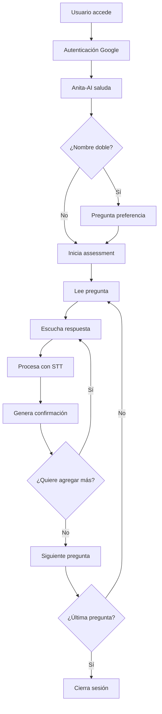

# 🤖 Agente Humanoide - Assessment IA Generativa

## 📋 Descripción del Proyecto

Sistema interactivo de voz para realizar assessments de conocimiento en Inteligencia Artificial Generativa para **Summan SAS**. El agente humanoide "Anita-AI" conduce conversaciones naturales y empáticas con ~75 usuarios entre el 11-15 de agosto de 2025.

### 🎯 Objetivos

- **Línea base de conocimiento** en IA generativa para estrategias de capacitación
- **Transformación cultural** basada en IA con enfoque humano
- **Experiencia empática** donde cada usuario se sienta escuchado y valorado
- **Conversación natural** sin botones, solo voz y texto

## 🏗️ Arquitectura del Sistema

### Stack Tecnológico

| Componente | Tecnología | Versión |
|------------|------------|---------|
| **Frontend** | React + TypeScript | 18.x |
| **Build Tool** | Vite | 5.x |
| **UI Framework** | Material-UI (MUI) | 5.x |
| **Backend** | Firebase Functions | Node.js 20 |
| **Base de Datos** | Firestore | - |
| **Autenticación** | Firebase Auth (Google) | - |
| **STT/TTS** | Google Gemini API | 2.5 Flash |
| **Generación de Texto** | Google Gemini API | 1.5 Flash |
| **Deploy** | Firebase Hosting | - |

### Estructura del Proyecto

```
AgenteHumanoide/
├── 📁 functions/                 # Firebase Cloud Functions
│   ├── src/index.ts             # Endpoints: tts, stt, generate
│   └── package.json
├── 📁 public/
│   ├── config/context.json      # Configuración del agente
│   └── data/assessment-questions.json
├── 📁 src/
│   ├── components/
│   │   ├── assessment/          # Componentes principales
│   │   └── auth/               # Autenticación
│   ├── services/               # Lógica de negocio
│   ├── test/                   # Scripts de testing
│   └── utils/                  # Utilidades
├── 📁 .env                     # Variables de entorno (NO subir)
└── 📄 SCRUM_PLAN.md           # Plan de desarrollo
```

## 🚀 Instalación y Configuración

### Prerrequisitos

- Node.js 20+ 
- npm o yarn
- Firebase CLI
- Cuenta Google Cloud (proyecto: `your_project_id`)

### 1. Clonar el Repositorio

```bash
git clone https://github.com/lufermalgo/AgenteHumanoide.git
cd AgenteHumanoide
```

### 2. Instalar Dependencias

```bash
# Frontend
npm install

# Firebase Functions
cd functions && npm install && cd ..
```

### 3. Configurar Variables de Entorno

Crear archivo `.env` en la raíz:

```env
# Google Cloud Platform
GOOGLE_PROJECT_ID=your_project_id
GOOGLE_APPLICATION_CREDENTIALS=./service-account-key.json

# Firebase Configuration (Frontend)
VITE_FIREBASE_API_KEY=your_firebase_api_key
VITE_FIREBASE_AUTH_DOMAIN=your_project_id.firebaseapp.com
VITE_FIREBASE_PROJECT_ID=your_project_id
VITE_FIREBASE_STORAGE_BUCKET=your_project_id.firebasestorage.app
VITE_FIREBASE_MESSAGING_SENDER_ID=your_messaging_sender_id
VITE_FIREBASE_APP_ID=your_firebase_app_id

# Gemini API
VITE_GEMINI_API_KEY=your_gemini_api_key

# D-ID API (opcional)
VITE_DID_API_KEY=your_d_id_api_key

# Configuración de Desarrollo
VITE_USE_AUTH_EMULATOR=false
VITE_USE_FIRESTORE_EMULATOR=false
```

### 4. Configurar Firebase

```bash
# Inicializar Firebase (si no está configurado)
firebase init

# Conectar al proyecto
firebase use your_project_id
```

## 🏃‍♂️ Desarrollo Local

### Iniciar Emuladores Firebase

```bash
# Terminar procesos existentes
pkill -f "firebase.*emulators" 2>/dev/null || true

# Iniciar emuladores
firebase emulators:start --only functions,hosting,firestore,auth,storage
```

### Iniciar Servidor de Desarrollo

```bash
# Terminal 1: Frontend
npm run dev

# Terminal 2: Emuladores (si no están corriendo)
firebase emulators:start --only functions,hosting,firestore,auth,storage
```

### URLs de Desarrollo

- **Frontend:** http://localhost:3002/
- **Firebase Emulator UI:** http://127.0.0.1:4001/
- **Functions:** http://127.0.0.1:5002/
- **Auth:** http://127.0.0.1:9091/
- **Firestore:** http://127.0.0.1:8081/

## 🧪 Testing

### Testing del Sistema Generativo

```bash
# Probar respuestas generativas
node test-generative-system.js

# Probar lógica de nombres
node test-name-logic.js

# Probar Gemini API
npx ts-node src/test/gemini-test.ts

# Probar TTS
npx ts-node src/test/gemini-audio-test.ts
```

### Testing de Funciones Firebase

```bash
# Probar endpoint generate
curl -X POST http://localhost:5002/your_project_id/us-central1/generate \
  -H 'Content-Type: application/json' \
  -d '{"systemPrompt":"Eres un asistente amigable.","userPrompt":"Di hola de forma cálida.","maxTokens":50}'

# Probar endpoint TTS
curl -X POST http://localhost:5002/your_project_id/us-central1/tts \
  -H 'Content-Type: application/json' \
  -d '{"text":"Hola, soy Anita-AI"}'
```

## 🎭 Configuración del Agente

### Personalidad: Anita-AI

El agente está configurado en `public/config/context.json`:

```json
{
  "persona": {
    "name": "Anita-AI",
    "style": {
      "tone": "Empático, cálido y cercano",
      "formality": "Informal pero respetuoso",
      "avoidLastNames": true,
      "noJargon": true
    }
  },
  "voices": {
    "defaultVoice": "Kore",
    "languageCode": "es-CO",
    "sayNameAs": {
      "Anita-AI": "Anita ei-ai"
    }
  }
}
```

### Características del Sistema

- **🎯 Context Engineering Real**: Respuestas generadas dinámicamente por Gemini
- **👤 Detección Inteligente de Nombres**: Identifica nombres dobles y pregunta preferencias
- **🗣️ Conversación Natural**: Sin botones, solo voz y turnos automáticos
- **⚡ Latencia Optimizada**: <2 segundos entre respuesta y respuesta
- **🔒 Autenticación Corporativa**: Solo usuarios @summan.com
- **📊 Persistencia Completa**: Sesiones y respuestas en Firestore

## 📊 Flujo de Usuario



## 🔧 API Endpoints

### `/api/tts` - Text-to-Speech
```typescript
POST /api/tts
{
  "text": "Hola, soy Anita-AI",
  "voiceName": "Kore"
}
```

### `/api/stt` - Speech-to-Text
```typescript
POST /api/stt
{
  "audioBase64": "base64_audio_data",
  "mimeType": "audio/webm"
}
```

### `/api/generate` - Generación de Texto
```typescript
POST /api/generate
{
  "systemPrompt": "Eres Anita-AI...",
  "userPrompt": "Saluda al usuario",
  "maxTokens": 200
}
```

## 🚀 Deployment

### Build de Producción

```bash
# Build frontend
npm run build

# Deploy a Firebase
firebase deploy
```

### Variables de Entorno de Producción

Configurar en Firebase Console:
- `GEMINI_API_KEY`
- `DID_API_KEY` (opcional)

## 📈 Métricas y Monitoreo

### Métricas de Éxito

- **Latencia**: <2 segundos end-to-end
- **Respuestas Generativas**: 100% únicas
- **Empatía**: Evaluación cualitativa
- **Personalización**: Por usuario
- **Uptime**: 99.9%

### Logs y Debugging

```bash
# Ver logs de Functions
firebase functions:log

# Ver logs de Firestore
firebase firestore:log

# Debug local
firebase emulators:start --debug
```

## 🔒 Seguridad

### Buenas Prácticas Implementadas

- ✅ **Variables de entorno** para claves sensibles
- ✅ **Autenticación corporativa** (@summan.com)
- ✅ **Validación de entrada** en todos los endpoints
- ✅ **CORS configurado** para desarrollo
- ✅ **Rate limiting** en Functions
- ✅ **Logs de auditoría** en Firestore

### Archivos Sensibles

**NO subir al repositorio:**
- `.env`
- `service-account-key.json`
- `*.pem`
- `*.key`

## 🤝 Contribución

### Flujo de Desarrollo

1. **Crear rama** desde `main`
2. **Desarrollar** con testing local
3. **Commit** con mensajes descriptivos
4. **Push** y crear Pull Request
5. **Review** y merge a `main`

### Convenciones de Código

- **TypeScript** estricto
- **ESLint** + **Prettier**
- **Commits** en español
- **Documentación** en código
- **Testing** obligatorio

## 📚 Documentación Adicional

- [SCRUM_PLAN.md](./SCRUM_PLAN.md) - Plan de desarrollo detallado
- [Context Engineering](./docs/context-engineering.md) - Configuración del agente
- [API Reference](./docs/api-reference.md) - Documentación de APIs
- [Deployment Guide](./docs/deployment.md) - Guía de despliegue

## 🆘 Troubleshooting

### Problemas Comunes

**Error: "API key not valid"**
```bash
# Verificar variable de entorno
echo $VITE_GEMINI_API_KEY
```

**Error: "Port already in use"**
```bash
# Limpiar procesos
pkill -f "firebase.*emulators"
pkill -f "vite"
```

**Error: "Firebase not initialized"**
```bash
# Verificar configuración
firebase projects:list
firebase use your_project_id
```

## 📞 Soporte

- **Desarrollador:** AI Assistant (Claude)
- **Proyecto:** Summan SAS - Agente Humanoide
- **Fecha límite:** 11 de agosto de 2025
- **Repositorio:** https://github.com/lufermalgo/AgenteHumanoide

---

**Última actualización:** 7 de agosto de 2025  
**Versión:** 1.0.0  
**Estado:** Sistema Generativo Completo ✅